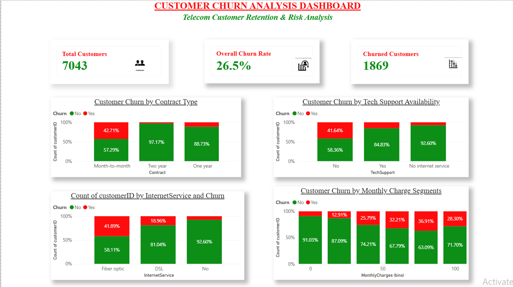
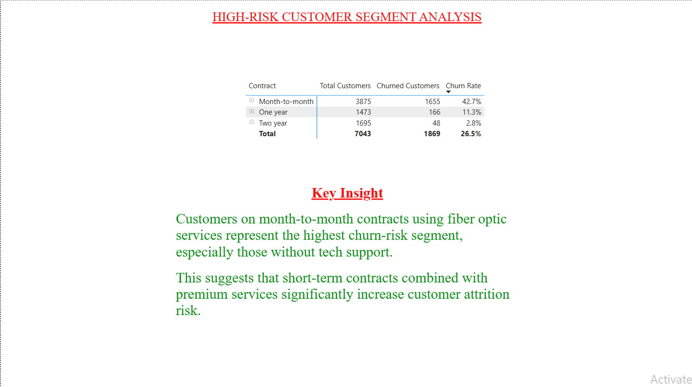

# Customer Churn Analysis (SQL Server Project)

## 🧭 Problem Statement

A subscription-based telecom company is experiencing high customer churn and wants to understand:

- How many customers are leaving?
- Why are they leaving?
- Which customer segments are most at risk?

The goal of this analysis is to identify key drivers of churn and provide actionable insights to improve customer retention.

---

## 🛠 Tools Used

- SQL Server Management Studio (SSMS)
- SQL (Data cleaning, aggregation, segmentation)
- Dataset: Telco Customer Churn Dataset (Kaggle)

---

## 📦 Dataset Overview

- Total customers: 7,043  
- Target variable: Churn (Yes/No)  
- Key features: Contract type, Monthly charges, Tech support, Internet service  

---

## 📊 Key Metrics

### Overall Churn Rate
- 26.54% of customers have churned  

This indicates a significant retention issue affecting revenue stability.

---

## 🔍 Key Insights

### 1. Contract Type is the Strongest Churn Driver
- Month-to-month: 42.71% churn  
- One year: 11.27% churn  
- Two year: 2.83% churn  

Short-term contracts are highly unstable and strongly associated with churn.

---

### 2. Higher Paying Customers Are More Likely to Leave
- Churned customers average monthly charges: 74.44  
- Retained customers average monthly charges: 61.27  

Price sensitivity is a likely factor influencing churn.

---

### 3. Tech Support Reduces Churn Risk
Customers without tech support show significantly higher churn compared to those with support.

---

### 4. High-Risk Customer Segment Identified
- Month-to-month + Fiber optic users show the highest churn rate: 57.52%

This is the most vulnerable customer group.

---

## 📈 Business Recommendations

- Encourage long-term contracts through incentives or discounts  
- Improve onboarding and engagement for month-to-month customers  
- Review pricing strategy for high-charge customers  
- Strengthen tech support accessibility and quality  
- Target high-risk segments with retention campaigns  

---

## 🧠 Conclusion

Customer churn is driven by a combination of:
- Contract structure  
- Pricing sensitivity  
- Service support availability  

Addressing these areas can significantly improve retention and reduce revenue loss.

## 📊 Dashboard Preview

### Executive Overview

### Customer Risk Segmentation

